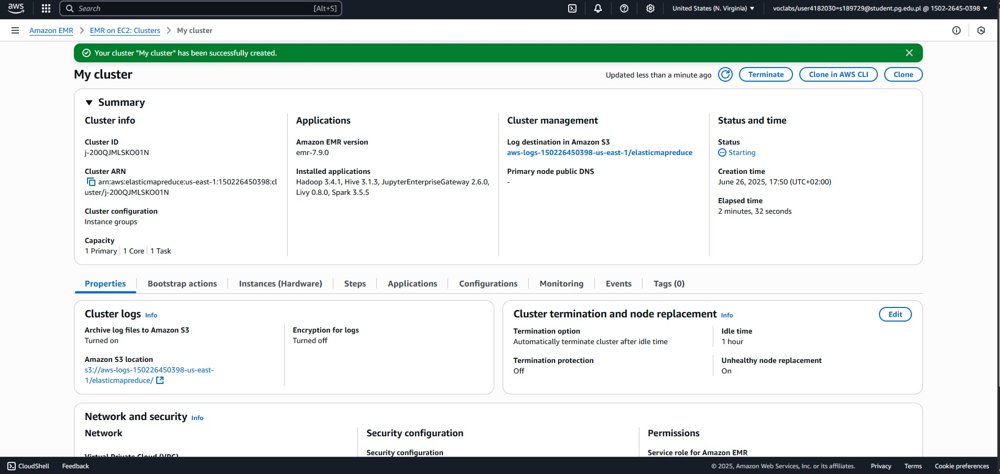
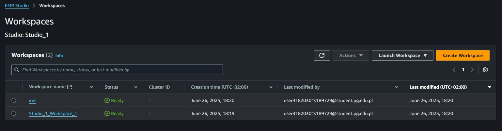
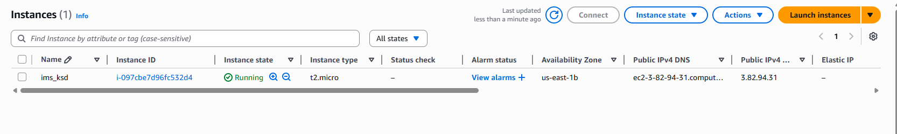
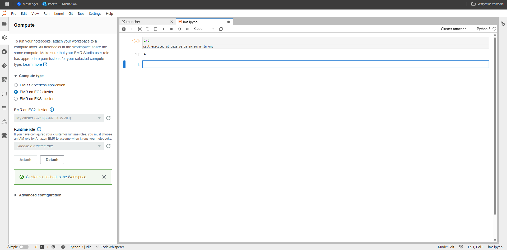
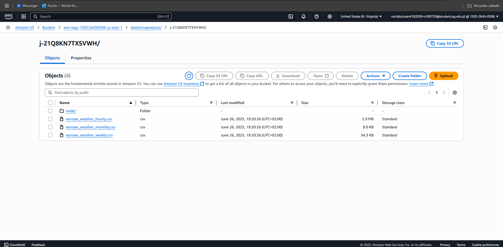
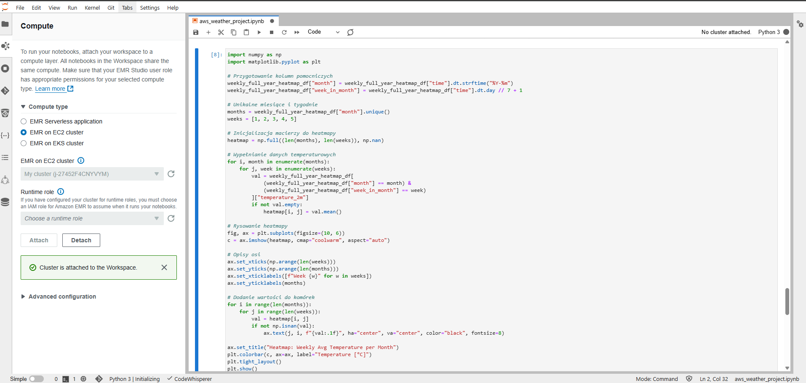
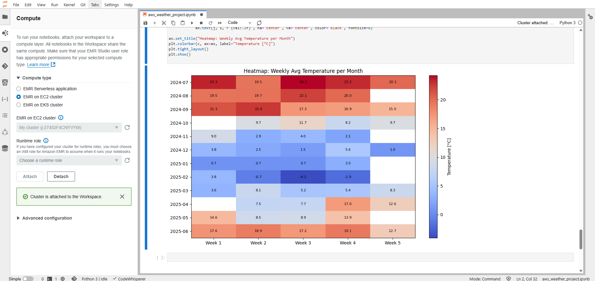

# AWS Configuration

To ensure scalable data processing and cloud-based development, we used **Amazon Web Services (AWS)** as the platform for building and running our project: **Local Weather Trends Dashboard**. The configuration steps were completed using student accounts provided via the **AWS Educate program**, which allowed us to access various AWS services without incurring additional costs.

The main goal of using AWS was to process large datasets efficiently with **Apache Spark**, store them in the cloud using **Amazon S3**, and provide interactive analysis through **SageMaker Studio notebooks**. Below is a detailed overview of the configuration process along with visual confirmation for each step.

## 1. Creation of an EMR Cluster

We configured and launched an **Amazon EMR cluster** (Elastic MapReduce) designed for distributed big data processing using Apache Spark. The cluster was successfully created with appropriate settings and ready for use.

## 2. Setup of SageMaker Studio and Workspaces

To enable interactive data exploration and coding, we set up **AWS SageMaker Studio**. This Jupyter-based development environment allows direct connection to the EMR cluster and integration with the S3 bucket.

As part of the setup, two separate workspaces were created:

- `Studio_1_workspace_1` – main workspace used for notebook execution and Spark integration,
- `ims` – auxiliary workspace for additional testing or development.

The SageMaker Studio environment was successfully initialized, with both workspaces appearing and functioning properly.

## 3. EC2 Instance for Auxiliary Tasks

As a support tool for potential additional tasks (e.g., file transfer, manual script execution), we created an **EC2 instance**. Although not strictly required for running Spark jobs, it provided flexibility and an alternative environment for debugging or managing files.

## 4. Initial Cluster Connection without Code

Before deploying any code, we verified the connection between our development environment and the Spark cluster. This ensured that job submission and remote execution would be possible later.

## 5. Uploading Data to S3 Bucket

The weather datasets in CSV format were uploaded to a dedicated **Amazon S3 bucket**. S3 served as the main storage for both input files and (optionally) output data. This enabled the Spark jobs to access files efficiently in a distributed manner.

## 6. Running Jupyter Notebook with Spark Jobs

Once the infrastructure was in place, the Python scripts for data loading, cleaning, aggregation, and visualization were run from a notebook connected to the EMR cluster. The notebook executed all code cells without issues.

## 7. Visualization Output on AWS

The final results — in the form of visualizations like heatmaps — were generated inside the notebook and displayed correctly using integrated plotting libraries.

